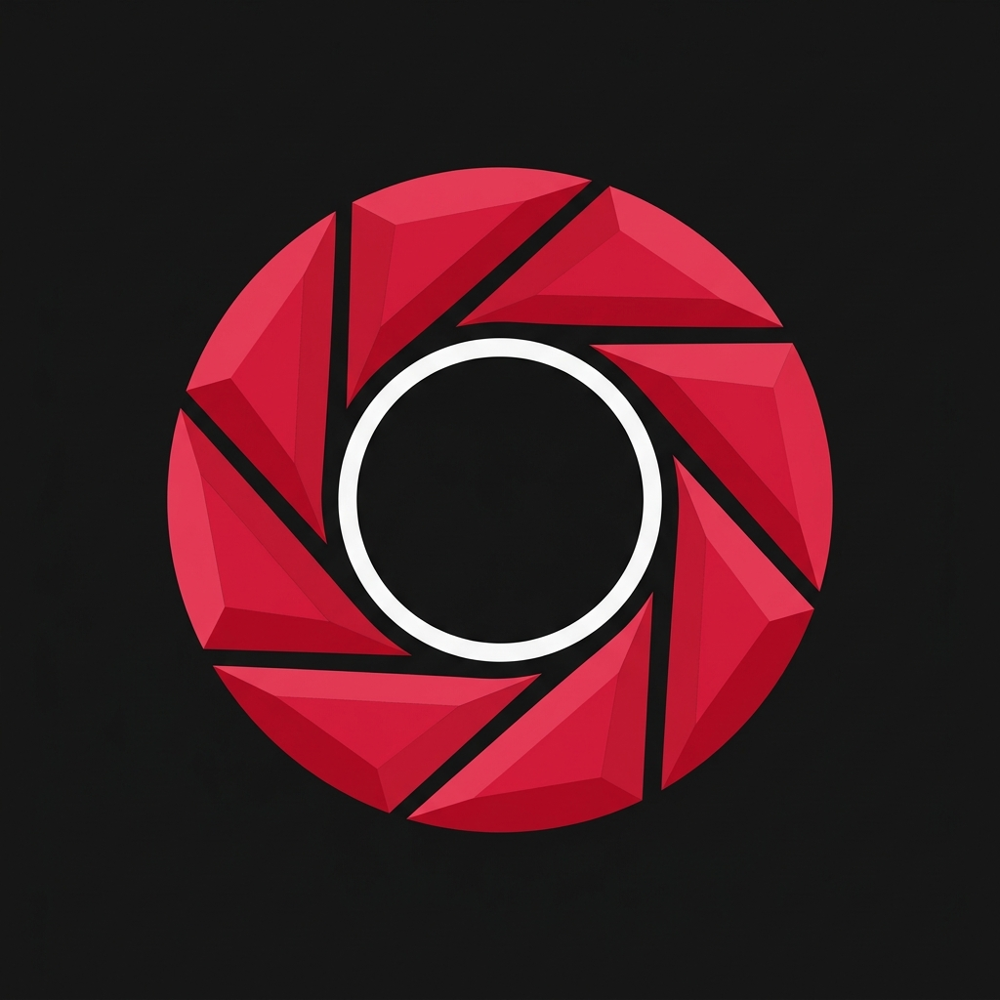

# GarnetCamera

  

GarnetCamera is a custom camera application for the Garnet device tree, built from the ground up using **Kotlin** and **Jetpack Compose**.

## Features
- **Lens Switching**: Easily switch between Macro (3), Wide (0), and Ultra-wide (2) lenses.
- **Modern Jetpack Compose UI**: Glassmorphic styling, smooth micro-animations, and full dark-theme integration.
- **Optimized Performance**: Separation of UI and camera operations via `CameraController` with background threading.
- **Custom Vendor Configurations**: Disabled ZSL (Zero Shutter Lag) for maximum compatibility with Xiaomi Garnet device tree vendor configs.

## Project Structure
- `src/com/garnet/camera/MainActivity.kt`: Entry point and UI view hosting.
- `src/com/garnet/camera/CameraController.kt`: Camera device controllers, lifecycles, states, and threads.
- `Android.bp`: Build configuration for compiling inside AOSP/Lineage build environments.
